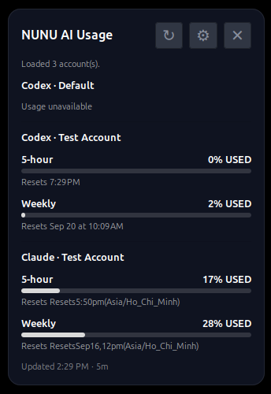

# NUNU AI Usage Linux

Monitor **Codex** and **Claude** usage directly from your Linux desktop.

**v0.2.0 · Linux Mint / Xfce / Cinnamon / MATE · X11**



NUNU gives you one small desktop widget for checking AI quota usage across multiple accounts — without opening provider websites.

## What it does

- Shows **OpenAI Codex** and **Anthropic Claude** usage in one place
- Supports **multiple accounts** per provider
- Displays **5-hour / weekly** usage, reset time, and **USED / LEFT** percentages
- Runs as a lightweight desktop widget with manual or automatic refresh
- Lets you choose which accounts appear on the widget
- Supports existing provider logins and isolated managed profiles

## Quick start

```bash
git clone https://github.com/nounou176/nunu-ai-usage-linux.git
cd nunu-ai-usage-linux
chmod +x install.sh
./install.sh
```

No `sudo` is required.

After installation:

```bash
nunu-ai-usage-widget      # open the desktop widget
nunu-ai-usage-settings    # manage accounts and widget settings
nunu-ai-usage             # print sanitized usage data
```

## Accounts and settings

NUNU can use provider accounts already authenticated on your computer, or create separate managed profiles for additional accounts.

From Settings you can:

- add Codex or Claude accounts
- show or hide accounts on the widget
- rename, reconnect, or remove accounts
- switch between **USED** and **LEFT** display modes
- change refresh interval
- configure widget position
- keep the widget above other windows
- start the widget automatically after login

## Desktop support

| Desktop | v0.2 behavior | Validation |
| --- | --- | --- |
| **Xfce / X11** | Universal GTK floating widget | Fully regression-tested |
| **Cinnamon / X11** | Native Cinnamon Desklet | Compatibility retained from v0.1 |
| **MATE / X11** | Universal GTK floating widget | Supported path, not yet fully real-session tested |
| **Wayland** | Not an official v0.2 target | XRandR-based placement currently targets X11 |

## Privacy

NUNU is designed to keep credentials in provider-owned or isolated provider profiles rather than copying secrets into the app config.

It does **not** store your provider password in the main NUNU configuration.

Default uninstall also preserves:

```text
~/.config/nunu-ai-usage-linux/
~/.local/share/nunu-ai-usage-linux/profiles/
~/.codex/
~/.claude/
```

CodexBarCLI is also left untouched by the uninstaller.

## Uninstall

```bash
./uninstall.sh
```

By default this removes NUNU application files, launchers, desktop integration, and runtime cache while preserving configuration and provider profiles.

Optional cleanup:

```bash
./uninstall.sh --delete-config
./uninstall.sh --delete-profiles
```

## v0.2 highlights

- Universal GTK desktop widget
- Xfce desktop integration
- Application Menu launcher
- XDG autostart support
- Widget singleton protection
- Drag-and-save widget placement
- Keep-above and start-after-login preferences
- Safer universal uninstaller
- Normalized reset-time display for Codex and Claude

See [CHANGELOG.md](CHANGELOG.md) for the full release history.

## License

MIT — see [LICENSE](LICENSE).
