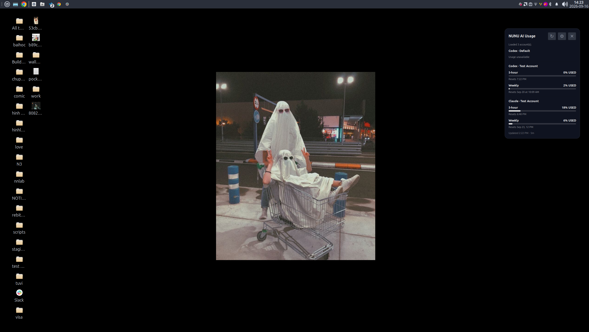
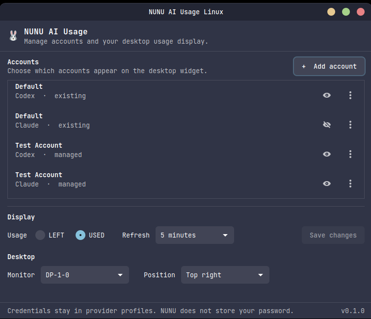
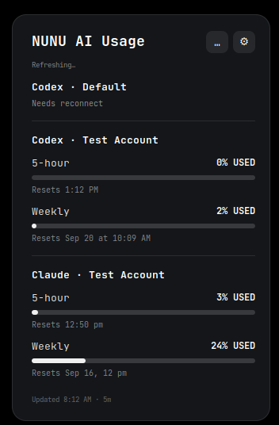
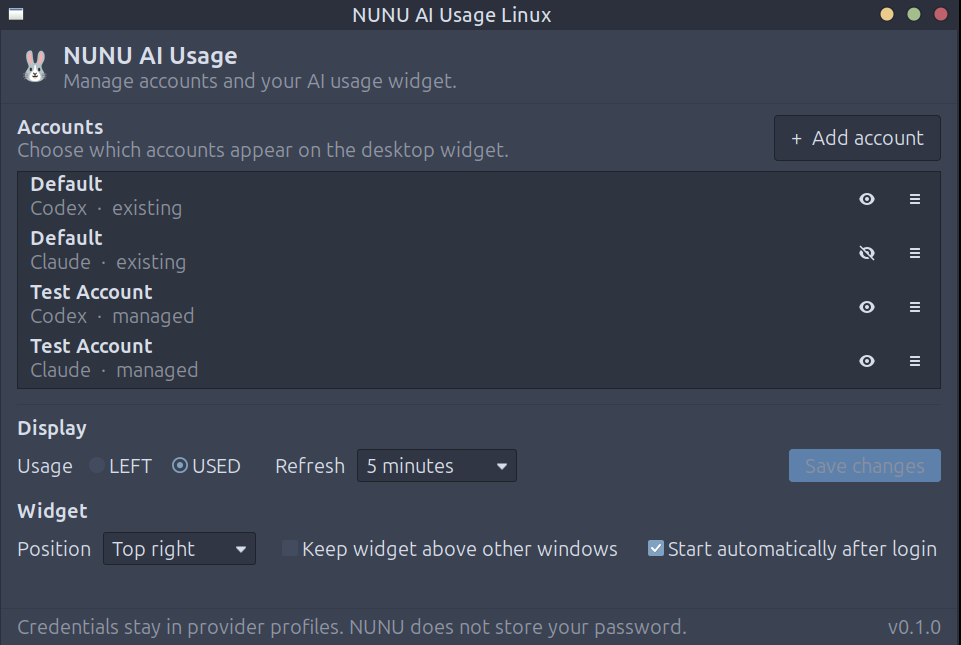
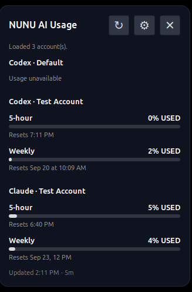

# NUNU AI Usage Linux

*(English version: [README.md](README.md))*

## Dùng để làm gì?

Xem usage của Claude và Codex ngay trên desktop — không cần mở terminal.



## Tính năng

- Xem usage của Claude và Codex ngay trên desktop
- Hỗ trợ nhiều tài khoản cùng lúc
- Tự do tùy biến vị trí và giao diện của widget
- Tự động làm mới dữ liệu (vẫn có thể làm mới thủ công)
- Hỗ trợ đa màn hình
- Tương thích Cinnamon (Desklet gốc) và Xfce/MATE (Universal GTK widget)

### Cinnamon

Setting | Display
:---: | :---:
 | 

### Xfce

Setting | Display
:---: | :---:
 | 

## Yêu cầu hệ thống

- Python 3
- GTK 3 Python bindings
- xrandr
- Codex CLI và/hoặc Claude CLI (tùy provider bạn dùng)
- Cinnamon cần thêm `gsettings` để tích hợp Desklet tự động

## Cài đặt

```bash
git clone https://github.com/nounou176/nunu-ai-usage-linux.git
cd nunu-ai-usage-linux
chmod +x install.sh
./install.sh
```

Không cần quyền sudo — trình cài đặt chạy theo từng user.

## Các lệnh chính

```bash
nunu-ai-usage-settings   # Mở cửa sổ Settings
nunu-ai-usage            # In dữ liệu usage
nunu-ai-usage-widget     # Chạy widget thủ công (Xfce/MATE)
```

## Gỡ cài đặt

```bash
./uninstall.sh
```

Mặc định giữ lại config, tài khoản đã lưu và CodexBarCLI.
Xem `./uninstall.sh --help` để biết tất cả tùy chọn.

## Tài liệu thêm

Xem thư mục `docs/` để biết chi tiết cài đặt, provider và tài khoản.

Xem [CHANGELOG.md](CHANGELOG.md) để biết toàn bộ lịch sử phát hành.

## License

MIT — xem [LICENSE](LICENSE).
